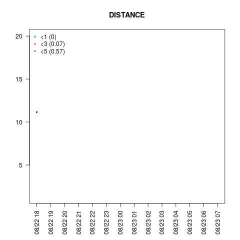
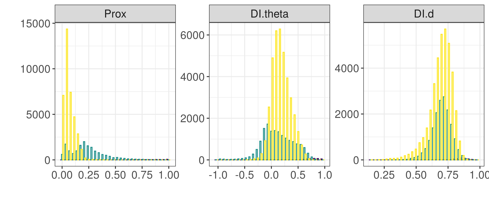
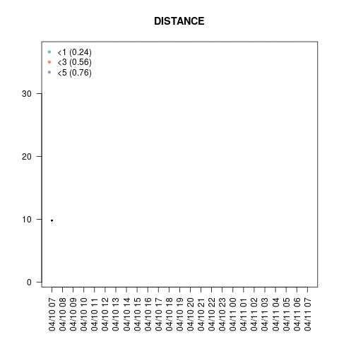
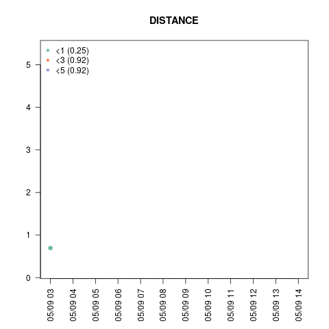
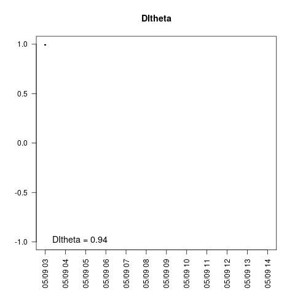
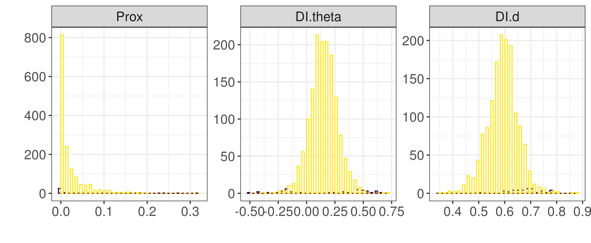

# Supplementary results

For each fleet, the most representative dyad in each group is shown through a spatial representation (the locations have been transformed to respect confidentiality agreements with some of the data providers) and time series of distance (in km), DItheta and DId. The numbers in parenthesis in the distance graphs indicate values of Prox with $\delta$ equal to 1, 3 or 5.

## Pelagic pair trawlers 

 

{width=60%}

Histogram for each group per metric.

 

### Group 1: most representative example

  

{width=40%}  {width=40%}

{width=40%} 
{width=40%}

### Group 2: most representative example

  

{width=40%}  {width=40%}

{width=40%} 
{width=40%}

### Group 3: most representative example

  

{width=40%}  {width=40%}

{width=40%} 
{width=40%}

## Large bottom otter trawlers

 

{width=60%}

Histogram for each group per metric.

 

### Group 1: most representative example

  

{width=40%}  {width=40%}

{width=40%} 
{width=40%}

### Group 2: most representative example

  

{width=40%}  {width=40%}

{width=40%} 
{width=40%}

### Group 3: most representative example

  

{width=40%}  {width=40%}

{width=40%} 
{width=40%}

## Small bottom otter trawlers

 

{width=60%}

Histogram for each group per metric.

 

### Group 1: most representative example

  

{width=40%}  {width=40%}

{width=40%} 
{width=40%}

### Group 2: most representative example

  

{width=40%}  {width=40%}

{width=40%} 
{width=40%}

### Group 3: most representative example

  

{width=40%}  {width=40%}

{width=40%} 
{width=40%}

## Mid-water otter trawlers

 

{width=60%}

Histogram for each group per metric.

 

### Group 1: most representative example

  

{width=40%}  {width=40%}

{width=40%} 
{width=40%}

### Group 2: most representative example

  

{width=40%}  {width=40%}

{width=40%} 
{width=40%}

### Group 3: most representative example

  

{width=40%}  {width=40%}

{width=40%} 
{width=40%}

## Anchovy purse-seiners

 

{width=60%}

Histogram for each group per metric. 

 

### Group 1: most representative example

  

{width=40%}  {width=40%}

{width=40%} 
{width=40%}

### Group 2: most representative example

  

{width=40%}  {width=40%}

{width=40%} 
{width=40%}

### Group 3: most representative example

  

{width=40%}  {width=40%}

{width=40%} 
{width=40%}

## Tuna purse-seiners

 

{width=60%}

Histogram for each group per metric. Purple and yellow are groups 2 and 3, respectively.

 

### Group 2: most representative example

  

{width=40%}  {width=40%}

{width=40%} 
{width=40%}

### Group 3: most representative example

  

{width=40%}  {width=40%}

{width=40%} 
{width=40%}

  <!-- * <a href=post-moveco1-intro.html>*A decade of movement ecology.*</a> Codes, data and supplementary materials for the manuscript of the same name. -->
