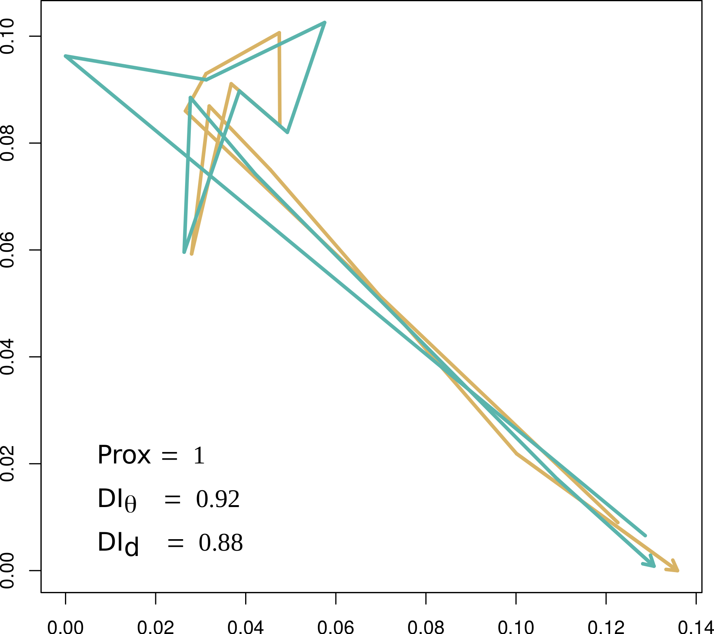

--- 
title: "Identifying partners at sea from joint movement metrics of pelagic pair trawlers"
author: "Rocío Joo, Nicolas Bez, Marie-Pierre Etienne, Pablo Marin, Nicolas Goascoz, Jérôme Roux, and Stéphanie Mahévas"
date: "`r Sys.Date()`"
site: bookdown::bookdown_site
output: bookdown::gitbook
documentclass: book
# bibliography: ["Bibliography/referencesthese.bib"]
# biblio-style: apalike
link-citations: yes
description: "Characterizing dyadic joint movement in world fisheries"
---

<!-- # Introduction -->

# Abstract of the manuscript

> **Note:** This is the companion website for the manuscript “Identifying partners at sea from joint movement metrics of pelagic pair trawlers”,
from Joo et al. 

Here we present an approach to identify partners at sea based on fishing track analysis, and describe this behaviour in six different fleets: 1) pelagic pair trawlers, 2) large bottom otter trawlers, 3) small bottom otter trawlers, 4) mid-water otter trawlers, all operating in the North-East Atlantic Ocean, 5) anchovy purse-seiners in the South-East Pacific Ocean, and 6) tuna purse-seiners in the Western Indian Ocean.
This type of behaviour is known to exist within pelagic pair trawlers, since these vessels need to be in pairs for their fishing operations. However, in practice, some of them decide to move together throughout their whole fishing trips, and others for only a segment of their trips. 
To identify partners at sea, we used a heuristic approach based on joint-movement metrics computed from vessel monitoring system data and Gaussian mixture models. The models were fitted to joint-movement metrics of the pelagic pair trawlers, and subsequently used to identify partners at sea in other fleets. We found partners at sea in all of the fleets except for  the tuna purse-seiners. 
We then analysed the connections at the scale of vessels and identified exclusive partners.
Exclusiveness was more common in pelagic pair trawlers and small bottom otter trawlers, with $82\%$ and $73\%$ of the vessels involved in partnerships having exclusive partners.  
This work shows that there are collective tactics at least at a pairwise level in diverse fisheries in the world. 

 

{width=40%}

